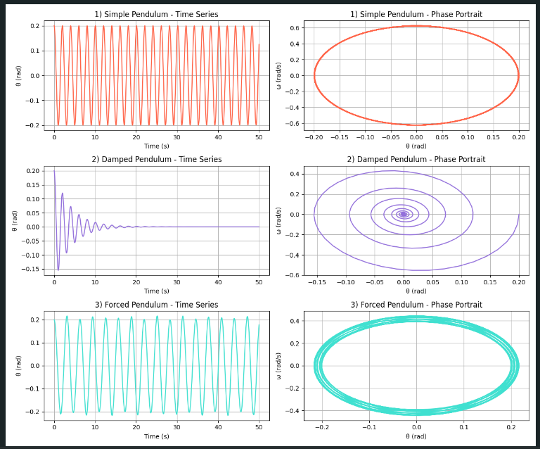

# Problem 1

# Investigating the Dynamics of a Forced Damped Pendulum

---

## 1. Theoretical Foundation

The forced damped pendulum is a classic example of a nonlinear dynamical system. It demonstrates rich behaviors depending on the amount of damping and external forcing.

### Governing Differential Equation

The motion is governed by:

$$
\frac{d^2\theta}{dt^2} + b\frac{d\theta}{dt} + \frac{g}{L} \sin\theta = A \cos(\omega t)
$$


Where:
- $\theta(t)$: Angular displacement  
- $b$: Damping coefficient  
- $g$: Acceleration due to gravity  
- $L$: Length of the pendulum  
- $A$: Amplitude of the external driving force  
- $\omega$: Angular frequency of the driving force  

---

### Full Derivation of the Equation

We begin with Newton’s second law for rotational motion:

$$
\sum \tau = I \cdot \alpha
$$

For a point mass $m$ on a pendulum of length $L$:

$$
I = mL^2
$$

The gravitational torque is:

$$
\tau_{\text{gravity}} = -mgL \sin(\theta)
$$

Include damping and external driving torque:

$$
\tau_{\text{total}} = -mgL \sin(\theta) - b \dot{\theta} + A \cos(\omega t)
$$

Apply Newton’s law:

$$
mL^2 \cdot \ddot{\theta} = -mgL \sin(\theta) - b \dot{\theta} + A \cos(\omega t)
$$

Divide both sides by $mL^2$:

$$
\ddot{\theta} + \frac{b}{mL^2} \dot{\theta} + \frac{g}{L} \sin(\theta) = \frac{A}{mL^2} \cos(\omega t)
$$

Define effective damping and amplitude:

- $b' = \frac{b}{mL^2}$  
- $A' = \frac{A}{mL^2}$

Then:

$$
\frac{d^2\theta}{dt^2} + b'\frac{d\theta}{dt} + \frac{g}{L} \sin(\theta) = A' \cos(\omega t)
$$

Or using standard notation:

$$
\frac{d^2\theta}{dt^2} + b\frac{d\theta}{dt} + \frac{g}{L} \sin\theta = A \cos(\omega t)
$$

---

### Small-Angle Approximation

For small angles ($\theta \ll 1$), we use:

$$
\sin \theta \approx \theta
$$

The equation becomes linear:

$$
\frac{d^2\theta}{dt^2} + b\frac{d\theta}{dt} + \frac{g}{L} \theta = A \cos(\omega t)
$$

This simplified form is easier to simulate and analyze, especially when damping and external forces are involved.

---

## 2. Python Simulation

We simulate 3 cases:

1. **Simple Pendulum** – no damping, no external force  
2. **Damped Pendulum** – includes damping, no external force  
3. **Forced Pendulum** – no damping, with external driving force  

### Code Block

```python
import numpy as np
import matplotlib.pyplot as plt
from scipy.integrate import solve_ivp

def forced_damped_pendulum(t, y, b, g, L, A, omega):
    theta, omega_ = y
    dydt = [omega_, -b * omega_ - (g / L) * np.sin(theta) + A * np.cos(omega * t)]
    return dydt

t_span = (0, 50)
t_eval = np.linspace(*t_span, 1000)
y0 = [0.2, 0.0]

configs = [
    {"label": "1) Simple Pendulum", "b": 0.0, "A": 0.0, "color": "tomato"},
    {"label": "2) Damped Pendulum", "b": 0.5, "A": 0.0, "color": "mediumpurple"},
    {"label": "3) Forced Pendulum", "b": 0.0, "A": 1.2, "color": "turquoise"},
]

g = 9.8
L = 1.0
omega_drive = 2.0

fig, axes = plt.subplots(len(configs), 2, figsize=(12, 10))

for i, cfg in enumerate(configs):
    sol = solve_ivp(
        forced_damped_pendulum,
        t_span,
        y0,
        args=(cfg["b"], g, L, cfg["A"], omega_drive),
        t_eval=t_eval
    )
    
    theta, omega_ = sol.y
    axes[i, 0].plot(sol.t, theta, color=cfg["color"])
    axes[i, 0].set_title(f'{cfg["label"]} - Time Series')
    axes[i, 0].set_xlabel("Time (s)")
    axes[i, 0].set_ylabel("θ (rad)")
    axes[i, 0].grid(True)
    
    axes[i, 1].plot(theta, omega_, color=cfg["color"])
    axes[i, 1].set_title(f'{cfg["label"]} - Phase Portrait')
    axes[i, 1].set_xlabel("θ (rad)")
    axes[i, 1].set_ylabel("ω (rad/s)")
    axes[i, 1].grid(True)

plt.tight_layout()
plt.show()
```

---


## 3. Results and Interpretation

**1) Simple Pendulum**  
- Time series: Perfect periodic oscillations.  
- Phase portrait: A clean ellipse, showing conserved energy.

**2) Damped Pendulum**  
- Time series: Oscillations decrease over time — energy is lost.  
- Phase portrait: Spiral pattern toward the origin.

**3) Forced Pendulum**  
- Time series: Oscillations stay active — external force drives the system.  
- Phase portrait: Loopy figure showing complex, non-conserved energy behavior.

---

## 4. Conclusion

This simulation shows how a pendulum's dynamics depend on damping and driving force. In the next step, we could:

- Add **chaotic driving conditions**  
- Create **Poincaré sections** or **bifurcation diagrams**  
- Compare **energy vs. time** plots
