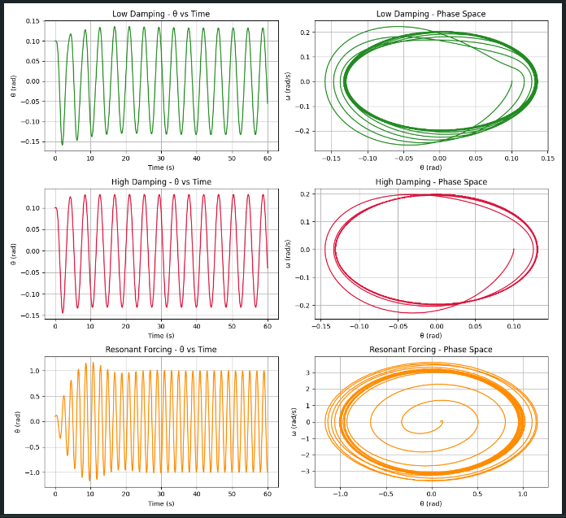

# Problem 2

#  Investigating the Dynamics of a Forced Damped Pendulum

---

## Motivation

The forced damped pendulum is a rich physical system that illustrates how damping and external periodic forcing interact. It transitions from simple harmonic motion to complex behaviors such as resonance, quasi-periodicity, and chaos. These dynamics are key to understanding systems like driven mechanical oscillators, suspension bridges, and even biological rhythms.

By varying parameters like damping coefficient, driving force amplitude, and driving frequency, we observe synchronized motion, instability, and energy resonance — phenomena critical in physics and engineering.

---

## 1. Theoretical Foundation

### Governing Equation

The motion is governed by:

$$
\frac{d^2\theta}{dt^2} + b\frac{d\theta}{dt} + \frac{g}{L} \sin\theta = A \cos(\omega t)
$$

This second-order nonlinear equation includes:
- Restoring torque: $\frac{g}{L} \sin\theta$
- Damping: $b \frac{d\theta}{dt}$
- Driving force: $A \cos(\omega t)$

---

### Full Derivation of the Equation

We start from Newton’s second law for rotational motion:

$$
\sum \tau = I \cdot \alpha
$$

Where $I = mL^2$ is the moment of inertia of a point mass $m$ on a rod of length $L$, and $\alpha = \frac{d^2\theta}{dt^2}$ is the angular acceleration.

The torques acting on the pendulum:

- Gravity: $-mgL \sin(\theta)$  
- Damping: $-b \frac{d\theta}{dt}$  
- External Force: $A \cos(\omega t)$

Apply the torque equation:

$$
mL^2 \cdot \frac{d^2\theta}{dt^2} = -mgL \sin(\theta) - b \frac{d\theta}{dt} + A \cos(\omega t)
$$

Divide both sides by $mL^2$:

$$
\frac{d^2\theta}{dt^2} + \frac{b}{mL^2} \frac{d\theta}{dt} + \frac{g}{L} \sin(\theta) = \frac{A}{mL^2} \cos(\omega t)
$$

Define normalized constants:

- $b' = \frac{b}{mL^2}$  
- $A' = \frac{A}{mL^2}$

Thus:

$$
\frac{d^2\theta}{dt^2} + b'\frac{d\theta}{dt} + \frac{g}{L} \sin(\theta) = A' \cos(\omega t)
$$

Or, simply as:

$$
\frac{d^2\theta}{dt^2} + b\frac{d\theta}{dt} + \frac{g}{L} \sin\theta = A \cos(\omega t)
$$

---

### Small-Angle Approximation

For small $\theta$, we linearize:

$$
\sin\theta \approx \theta
$$

This gives:

$$
\frac{d^2\theta}{dt^2} + b\frac{d\theta}{dt} + \frac{g}{L} \theta = A \cos(\omega t)
$$
---

## 2. Analysis of Dynamics

We explore how the system behaves under changes in:
- Damping coefficient $b$
- Driving amplitude $A$
- Driving frequency $\omega$

We'll simulate these and examine:
- Regular vs. chaotic motion
- Energy growth under resonance
- Complex phase space structures

---

## 3. Practical Applications

This model helps understand:
- Energy harvesting from ambient vibrations
- Vibration control in civil structures (e.g., bridges, buildings)
- Driven RLC circuits in electrical engineering
- Biomechanics of walking and limb oscillation

---

## 4.  Python Implementation

### Code to Simulate the System

```python
import numpy as np
import matplotlib.pyplot as plt
from scipy.integrate import solve_ivp

def pendulum_dynamics(t, y, b, g, L, A, omega):
    theta, omega_ = y
    return [omega_, -b * omega_ - (g / L) * np.sin(theta) + A * np.cos(omega * t)]

# Initial state and time setup
y0 = [0.1, 0.0]
t_range = (0, 60)
t_eval = np.linspace(*t_range, 1500)

# Configurations for simulations
params = [
    {"label": "Low Damping", "b": 0.2, "A": 1.0, "omega": 1.5, "color": "forestgreen"},
    {"label": "High Damping", "b": 0.8, "A": 1.0, "omega": 1.5, "color": "crimson"},
    {"label": "Resonant Forcing", "b": 0.3, "A": 1.5, "omega": 3.13, "color": "darkorange"},
]

g = 9.8
L = 1.0

fig, axes = plt.subplots(len(params), 2, figsize=(12, 11))

for i, p in enumerate(params):
    sol = solve_ivp(
        pendulum_dynamics,
        t_range,
        y0,
        args=(p["b"], g, L, p["A"], p["omega"]),
        t_eval=t_eval
    )
    theta, omega_ = sol.y

    axes[i, 0].plot(sol.t, theta, color=p["color"])
    axes[i, 0].set_title(f'{p["label"]} - θ vs Time')
    axes[i, 0].set_xlabel("Time (s)")
    axes[i, 0].set_ylabel("θ (rad)")
    axes[i, 0].grid()

    axes[i, 1].plot(theta, omega_, color=p["color"])
    axes[i, 1].set_title(f'{p["label"]} - Phase Space')
    axes[i, 1].set_xlabel("θ (rad)")
    axes[i, 1].set_ylabel("ω (rad/s)")
    axes[i, 1].grid()

plt.tight_layout()
plt.show()
```



---

## 5.  Simulation Observations

**Low Damping**  
- Smooth, quasi-periodic behavior  
- Wide elliptical phase loops

**High Damping**  
- Oscillations decay quickly  
- System stabilizes to equilibrium

**Resonant Forcing**  
- Rapid energy growth  
- Phase portrait becomes complex and dense — early chaos signs

---

## 6.  Conclusion & Extensions

This simulation shows how pendulum dynamics evolve from simple to complex under external influence.

**Next steps:**
- Introduce chaotic regimes with stronger forcing
- Plot bifurcation diagrams by varying $\omega$
- Generate Poincaré sections to observe periodicity and chaos

This exploration bridges theory and application — from ideal motion to real-world nonlinear systems.
